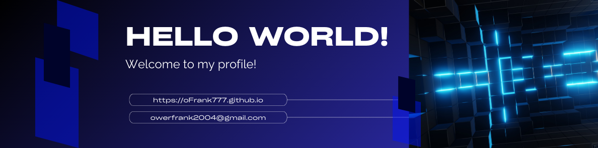

<!--Banner Principal-->

<!-- Sección de Cabecera y Biografía -->
<table border="0">
  <tr>
    <td width="65%" valign="top">
      <h1> I'M OWER FRANK!</h1>
      
<b>Systems Engineering Student | Full Stack Developer | Data & Software Solutions</b>

      

        🚀 Passionate <b>Systems Engineering student</b> dedicated to crafting robust digital solutions and exploring the vast landscape of <b>Artificial Intelligence</b>. I specialize in building scalable web and mobile applications using modern frameworks like <b>React, Flutter, Python (Django / Flask), and Java</b>, emphasizing <b>clean architecture, performance, and maintainability</b>. I continuously expand my knowledge in <b>AI, machine learning, and cloud computing</b>, aiming to deliver <b>data-driven software solutions</b> that solve real-world problems.
      

      

        
        
        
      

       
      <blockquote>
        ✨ <i>Student of life. I believe every day is a learning opportunity.</i>
      </blockquote>
    </td>
    <td width="35%" valign="middle" align="right">
      
    </td>
  </tr>
</table>

---

<!-- Sección de Tecnologías y Conocimientos -->
<h2 align="center">🛠️ Mʏ Tᴇᴄʜ Sᴛᴀᴄᴋ & Kɴᴏᴡʟᴇᴅɢᴇ</h2>

<picture>
  <source media="(prefers-color-scheme: dark)" srcset="./Skills_Animation_Dark.gif">
  <source media="(prefers-color-scheme: light)" srcset="./Skills_Animation_White.gif">
  
</picture>

<h3 align="left">📚 Cᴜʀʀᴇɴᴛ Lᴇᴀʀɴɪɴɢ</h3>
<ul align="left">
  <li><b>Software Development:</b> Design and development of web and mobile applications using Python, JavaScript, React and Flutter.</li>
  <li><b>Backend & APIs:</b> Development of RESTful APIs with Django, Flask and Node.js, including authentication and database integration.</li>
  <li><b>Systems Engineering:</b> Strong foundations in operating systems, distributed systems, software architecture and systems programming.</li>
  <li><b>Databases:</b> Relational database design and management using MySQL and SQLite.</li>
  <li><b>AI & Data Analysis:</b> Practical experience in data analysis with Python and continuous learning in machine learning fundamentals.</li>
  <li><b>DevOps & Cloud Tools:</b> Version control with Git/GitHub, containerization with Docker and deployments on platforms like Vercel and Railway.</li>
</ul>

 

  <h3 align="center">Programming Languages</h3>
  
  
  
  
  
  
  
   
  
  
  
  

  <h3 align="center">Frontend & Mobile</h3>
  
  
  
  
  
  
  
  

  <h3 align="center">Backend & Frameworks</h3>
  
  
  
  
  
  

  <h3 align="center">AI, Data Science & Cloud</h3>
  
  
  
  
  
   
  
  
  
  
  

  <h3 align="center">Professional Tools & DevOps</h3>
  
  
  
  
  
  
  
   
  
  
  
  
  

---

<!-- Sección de Proyectos Destacados (8 proyectos) -->
<h2 align="center">🚀 Fᴇᴀᴛᴜʀᴇᴅ Pʀᴏᴊᴇᴄᴛs</h2>

<table align="center">
  <tr>
    <td width="50%" valign="top">
      <h3 align="center">💻 duhvia-site</h3>
      
Modern high-performance web landing page built with <b>React 19</b>, <b>TypeScript</b>, and <b>Tailwind CSS 4</b>.

      
<a href="https://github.com/oFrank777/duhvia-site"><b>Explore Repo →</b></a>

    </td>
    <td width="50%" valign="top">
      <h3 align="center">🤖 ASISTENTEVIRTUAL</h3>
      
Automation tool leveraging <b>Python</b> for speech-to-text, system interaction, and AI functionalities.

      
<a href="https://github.com/oFrank777/ASISTENTEVIRTUAL"><b>Explore Repo →</b></a>

    </td>
  </tr>
  <tr>
    <td width="50%" valign="top">
      <h3 align="center">📊 ChurnInsight Frontend</h3>
      
Performance-optimized dashboard for customer churn analysis. Built with <b>Vite</b> and focus on UX.

      
<a href="https://github.com/oFrank777/ChurnInsight-Frontend"><b>Explore Repo →</b></a>

    </td>
    <td width="50%" valign="top">
      <h3 align="center">🔗 ChurnInsight Backend</h3>
      
Enterprise-grade orchestrator with <b>Spring Boot 3.4.1</b>, <b>Java 17</b>, and <b>Hibernate</b>.

      
<a href="https://github.com/oFrank777/ChurnInsight-Backend"><b>Explore Repo →</b></a>

    </td>
  </tr>
  <tr>
    <td width="50%" valign="top">
      <h3 align="center">📱 Elderly Care App</h3>
      
Flutter mobile solution with <b>SQLite/Firebase</b> hybrid architecture and high-priority notifications.

      
<a href="https://github.com/oFrank777/elderly-care-app-flutter"><b>Explore Repo →</b></a>

    </td>
    <td width="50%" valign="top">
      <h3 align="center">🌐 FinalProject-Pweb</h3>
      
Collaborative web engineering project showcasing modern development workflows and UI/UX design.

      
<a href="https://github.com/oFrank777/FinalProject-Pweb"><b>Explore Repo →</b></a>

    </td>
  </tr>
  <tr>
    <td width="50%" valign="top">
      <h3 align="center">🛠️ LAB06-PWEB2</h3>
      
Advanced web programming lab focusing on complex UI components and business logic implementation.

      
<a href="https://github.com/oFrank777/LAB06-PWEB2"><b>Explore Repo →</b></a>

    </td>
    <td width="50%" valign="top">
      <h3 align="center">📈 Data Analysis with Python</h3>
      
Comprehensive data analysis and visualization using <b>Pandas</b>, <b>NumPy</b>, and <b>Matplotlib</b>.

      
<a href="https://github.com/oFrank777/An-lisisDeDatosConPythonCha"><b>Explore Repo →</b></a>

    </td>
  </tr>
</table>

---

<!-- Estadísticas y Actividad con Estilo Premium -->
<h2 align="center">⚡ Gɪᴛʜᴜʙ Aᴄᴛɪᴠɪᴛʏ</h2>

  
  

 

  

 

<!-- Gráfico del Juego Pacman -->
<h3 align="center">🎮 Pᴀᴄ-Mᴀɴ Cᴏɴᴛʀɪʙᴜᴛɪᴏɴs 🎮</h3>

  
  

 

<!-- Gráfico de Actividad en Tiempo Real -->
<h3 align="center">📈 Rᴇᴄᴇɴᴛ Aᴄᴛɪᴠɪᴛʏ 📈</h3>

    

---

<!-- Sección de Inspiración Diaria -->
<h2 align="center">🌟 Tʜᴏᴜɢʜᴛ ᴏғ ᴛʜᴇ Dᴀʏ 🌟</h2>
<!--STARTS_HERE_QUOTE_CARD-->

    

<!--ENDS_HERE_QUOTE_CARD-->

---

<!-- Sección de Contacto -->
<h2 align="center">🤝 Cᴏɴɴᴇᴄᴛ Wɪᴛʜ Mᴇ 🤝 </h2>

 

<!-- Pie de Página Premium -->

  

